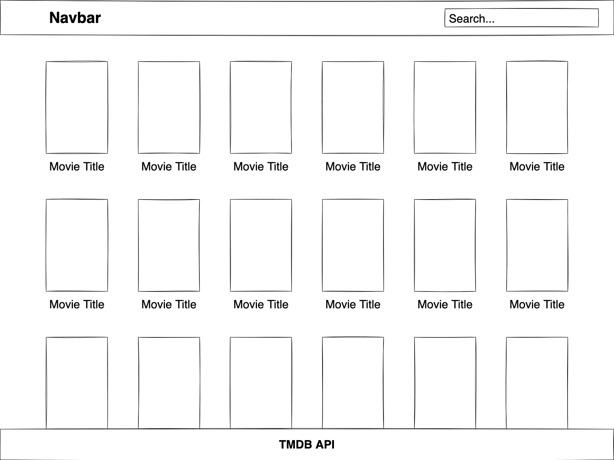

# The Movie Database API Project

This is a collaborative project with [Libby Henry](https://github.com/LibbyH52) that uses the [TMDB API](https://www.themoviedb.org/documentation/api).

This project was bootstrapped with [Create React App](https://github.com/facebook/create-react-app).

## Design

## Cloning the Repository

To clone the repository and make a local copy on your computer, follow these steps:

- Open [GitHub](https://github.com/) and locate the GitHub repository: [https://github.com/KirstChat/movie-db-api-project](https://github.com/KirstChat/movie-db-api-project)
- Under the repository name, click **"Code"** and copy the link to clone the repository using **"HTTPS"**
- After copying the link, open a terminal on your computer - this step can also be done in the terminal in your preferred IDE or Code Editor
- Change the current working directory to the location where you want the cloned directory to be saved
- Type `git clone`, and then paste the URL: [https://github.com/KirstChat/movie-db-api-project.git](https://github.com/KirstChat/movie-db-api-project.git)
- Press Enter to create a local clone
- Open the terminal and run `npm install` to install required packages
- If you are unable to install packages, download and install [Node.js](https://nodejs.org/en/)
- To run the app in development mode, run the `npm start` command in the terminal

To add your own TMDB API Key, follow these steps:

- Open [TMDB](https://www.themoviedb.org/) and sign up for an account
- After signing up for account, open account settings which can be found under your profile
- Open the API settings and request an API key (this is free to use)
- In the repo, create an environment variable file: `.env.local`
- Add the variable `REACT_APP_API_KEY='YOUR API KEY'`

## Credits

- [The Movie Database API](https://developers.themoviedb.org/3/getting-started/introduction)
- [React Documentation](https://reactjs.org/docs/getting-started.html)
- [React Front to Back](https://www.udemy.com/course/modern-react-front-to-back/)
- [How to use Axios with React](https://www.freecodecamp.org/news/how-to-use-axios-with-react/)
- [Get Requests in React using Async/Await](https://dev.to/redeyemedia/get-requests-in-react-using-async-await-7jd)
- [Text Gradient with Font Awesome](https://stackoverflow.com/questions/12732663/text-gradient-with-font-awesome)
- [useFetch Component](https://www.youtube.com/watch?v=j942wKiXFu8&list=PL4cUxeGkcC9gZD-Tvwfod2gaISzfRiP9d&index=1)
